# EDIM — CTO Business Platform

**제품 코드 한 줄에서 BOM · 도면 · 원가 · 견적 · 기술 자료 · 구매 요청이 나온다.**
공기조화기(AHU) 같은 주문 생산(Configure-to-Order) 제품을 위한 CPQ + PLM + ERP 통합 플랫폼의 베타입니다.

> 상태(2026-09-27 · main): 발표 시나리오 e2e **234/234** · 단위 테스트 **203**(vitest) + auth PASS · DB 검증 **9종** PASS · 청사진 70장 중 **실동 18 · 부분 28 · 미착수 5**(개념·표지 19 — 2026-09-27 판정은 초안)
> 이 수치는 **Windows 11 로컬 실측**입니다(Node 24 · pnpm 9.15.4 · Docker PG16 · Python 3.12). Windows 첫 실행은 2026-09-26, 이후 e2e 를 여러 번 연속으로 돌렸습니다 — 아래 [정직 고지](#정직-고지) 참조.

## 📸 화면

| 작업대 — 청사진 p56 의 다섯 구역 | 코드 조립 A▼B▼C▼D▼E▼F▼ · 개정 Rev A→B | BOM Run → EBOM → Cost |
|---|---|---|
| 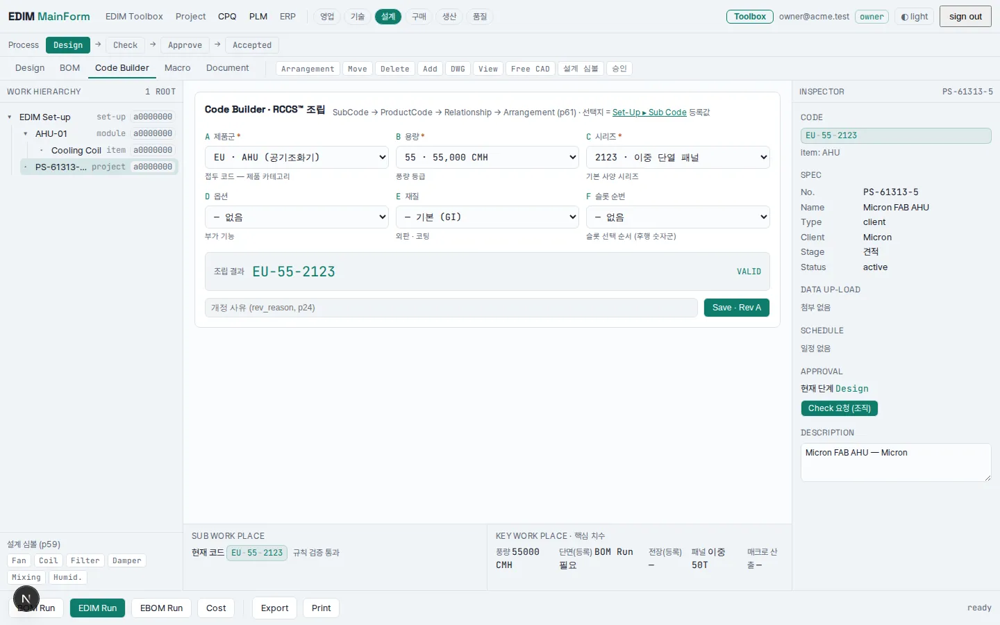 | 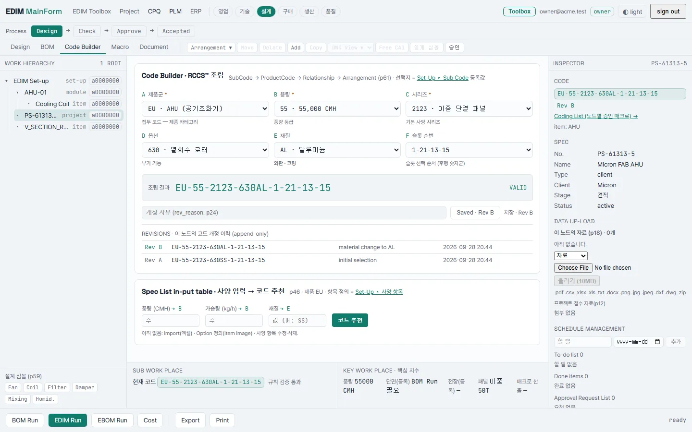 | 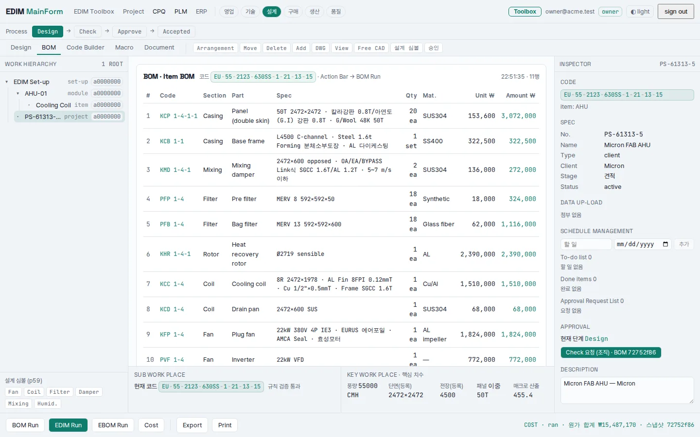 |

| 매크로 — 검증 → 초안 → 승인 | Toolbox — 식을 말로, 흐름도로 (LLM 없이) | Set-Up — 코드 관계가 곧 BOM |
|---|---|---|
| 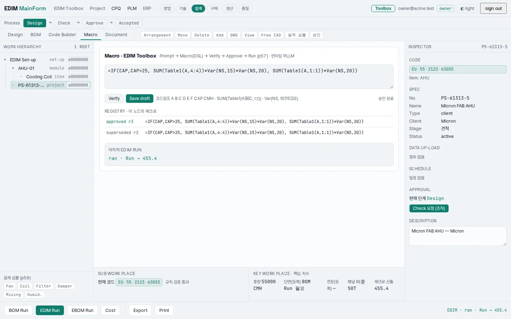 | 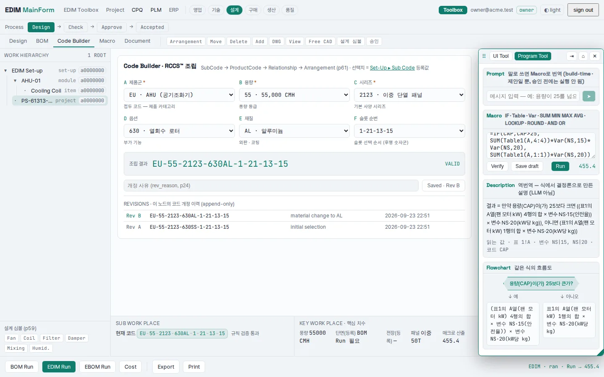 | 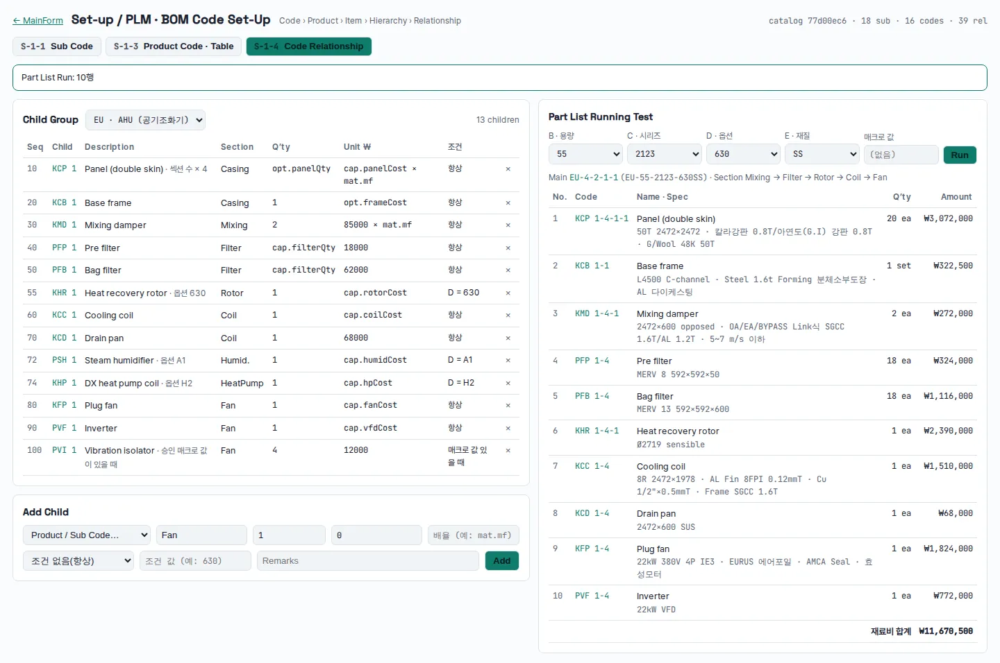 |

| 도면 — 등록 치수 표에서 나온다 | 견적 · Tech Data · 구매 요청 | 구매 요청 → 견적 요청 → 발주 |
|---|---|---|
| 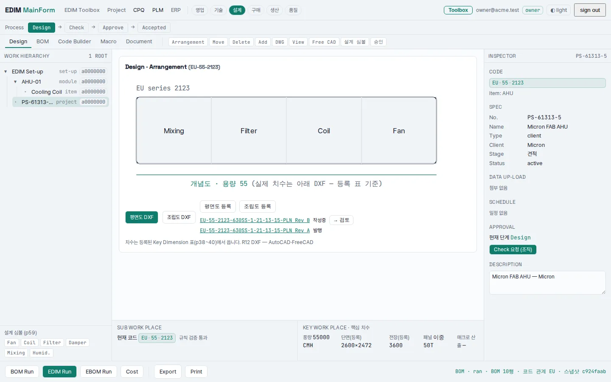 | 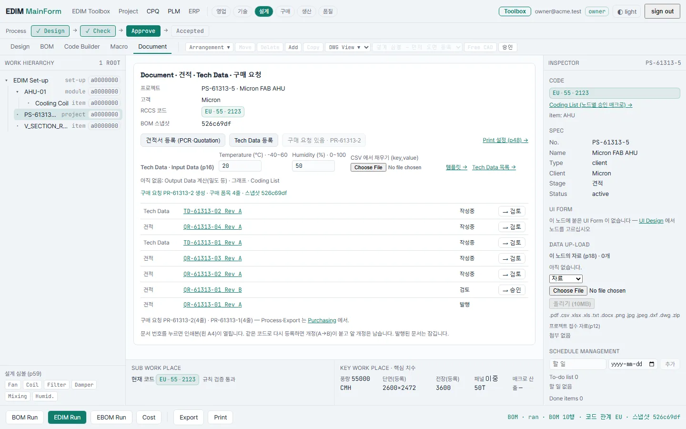 | 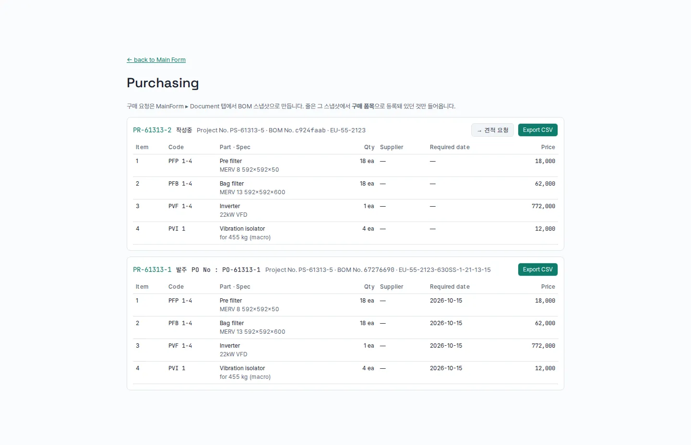 |

| 견적서 인쇄본 — 합계는 BOM 에 저장된 원가 그대로 | 조립도(DXF 를 다시 그린 것) | 플랫폼 콘솔 — 고객사 업무 데이터는 없다 |
|---|---|---|
| 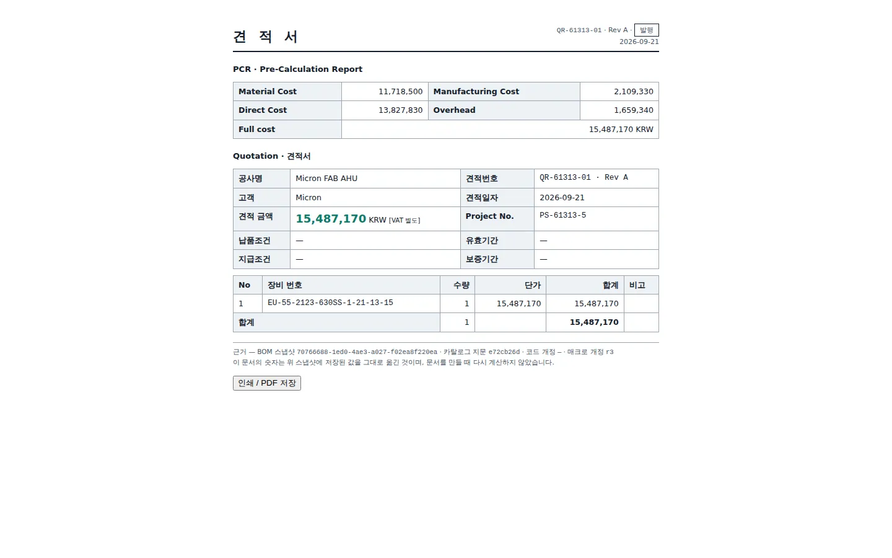 | 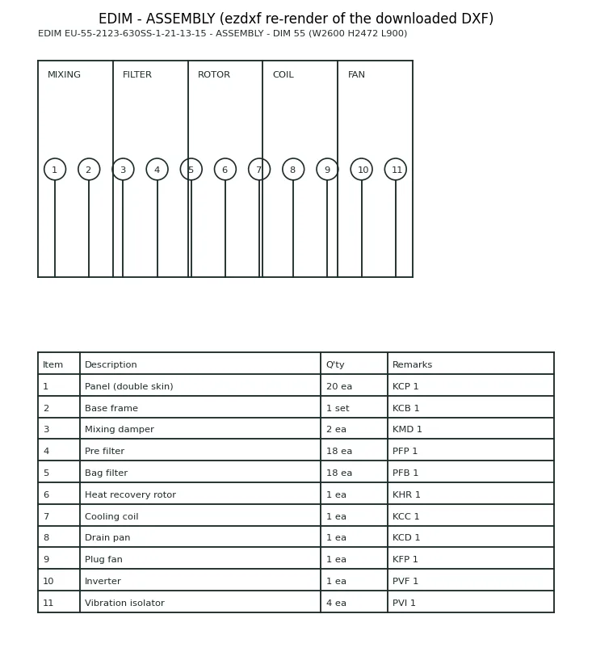 | 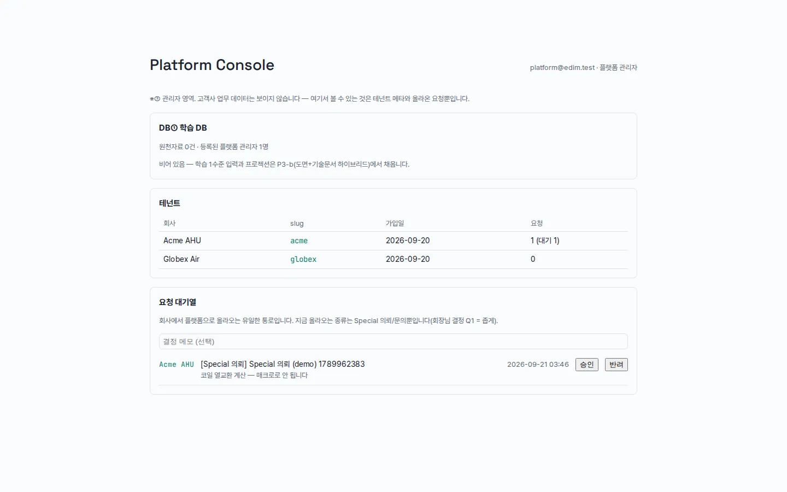 |

전체 27장: [`docs/screens/`](docs/screens). 목업이 아니라 `scripts/demo_e2e.py` 가 매번 새로 찍는 실제 화면입니다(`scripts/publish_screens.py` 로 갱신).

## 핵심 아이디어

1. **제품의 속성을 코드로 만든다 (RCCS).** `EU-55-2123-630SS` — 드롭다운 여섯 개가 코드 한 줄이 되고, 규칙에 어긋나면 VALID 가 뜨지 않는다.
2. **BOM 은 계산식이 아니라 등록된 관계다.** Set-Up 에서 코드 · 하위 코드 · 관계 · 표를 등록하면, BOM Run 은 그 관계를 따라 내려갈 뿐이다. 회사가 표 한 칸을 고치면 BOM · 매크로 · 도면이 따라 바뀐다.
3. **모든 산출물은 BOM 스냅샷 하나에서 나온다.** EBOM · 원가 · 도면 · 견적 · Tech Data · 구매 요청은 다시 계산하지 않고 **그때 저장된 스냅샷(`runId`)을 읽는다.** 그래서 견적 합계와 원가 카드는 한 원도 다를 수 없고, 인쇄본 발치에는 어느 BOM · 어느 코드 개정 · 어느 매크로 개정에서 나온 숫자인지가 찍힌다.
4. **실행에 LLM 이 없다.** 매크로는 검증 → 초안 → 승인을 거친 식만 돌고, 같은 입력이면 같은 답이 나온다.
5. **승인은 BOM 한 장에 붙는다.** 승인 요청은 BOM 스냅샷을 가리키고, 도면·문서의 발행과 구매 발주는 **승인된 BOM 에서만** 된다. 승인 뒤에 치수를 고쳐 다시 돌린 것은 새 BOM 이라 옛 승인으로 나갈 수 없다.
6. **막는 것은 DB 가 막는다.** 고객사 격리(RLS) · 개정 이력 append-only · 발행된 도면/문서와 발주된 구매 요청의 잠금 · 플랫폼 계정의 고객 데이터 열람 차단은 애플리케이션 `if` 가 아니라 Postgres 권한과 트리거다.

## 지금 어디까지

| 자료 | 내용 |
|---|---|
| [`docs/00-corpus/page-map.md`](docs/00-corpus/page-map.md) | **청사진 70쪽 대조** — 쪽마다 도는 것 · 없는 것 · 근거(e2e 단계) |
| [`docs/plan/connection-ledger.md`](docs/plan/connection-ledger.md) | **연결 장부** — 구역과 구역이 이어져 있는가 (이어짐 12 · 약함 0 · 없음 2) |
| [`docs/DEMO.md`](docs/DEMO.md) | 발표 절차서 — Windows 로컬 준비 + 시연 대본 11장면 |

| 카드 | 상태 |
|---|---|
| P1 코드 기반 등뼈 (Sub Code · Product Code · Relationship → BOM) | 완료 |
| P2 Toolbox (플로팅 창 · 역번역 · 흐름도 · 명령 동기화) | 완료(부분) — 자연어→매크로 실모델 호출 0회 |
| P3-a 플랫폼 관리자 계층 (3계층 · DB①/② 권한 분리) | 완료 |
| P4-a 치수 전파 · 도면 (Key Dimension → DXF · 개정 · 발행 잠금) | 완료 |
| P4-b 견적/PCR · Tech Data · 구매 요청 | 완료 |
| P3-b DB①→DB② 프로젝션 · 학습 1수준 | 미착수 — DXF 추출 연구 결과 후 |
| P3-c Special Tool Box 슬롯 | 미착수 — 첫 시연 사례(D1) 결정 후 |
| P6 통합 (승인 ↔ BOM 스냅샷 · 발행/발주는 승인된 BOM 에서만 · 추적) | 완료 |
| P5 발표 | 80% 완성 후 |

## 아키텍처 개요

```
                 ┌──────────────────────── apps/web (Next.js App Router) ────────────────────────┐
  Set-Up         │  MainForm 작업대            Toolbox(플로팅)        Purchasing     Platform Console │
  코드·관계·표 ──▶│  Code Builder → BOM Run ──▶ [ BOM 스냅샷 runId ] ──┬─▶ EBOM · Cost               │
                 │        ▲                          ▲               ├─▶ 도면 DXF (등록 치수 표)     │
  매크로 승인 ───▶│  EDIM Run(서버 실행) ─────────────┘               ├─▶ 견적/PCR · Tech Data        │
                 │                                                   └─▶ 구매 요청 → 발주 · CSV      │
                 └───────────────────────────────────────────────────────────────────────────────┘
   packages/bom-code      등록 관계를 돌려 BOM 을 내는 순수 엔진 (슬롯 1,200 조합 회귀)
   packages/macro-*       DSL 파서 · 컴파일 · 정적 검증 · 승인 레지스트리
   packages/db            Prisma 스키마 · 마이그레이션 0001~0010 · RLS · 트리거 · 도메인 함수
   packages/auth          세션 · 테넌트 결정 · RBAC        packages/hierarchy-address   Work Hierarchy 주소
   PostgreSQL 16          역할 3개 — 소유자(마이그레이션) · edim_app(회사, RLS) · edim_platform(DB① 만)
```

3계층 권한: **플랫폼 관리자 → 회사 관리자 → 사용자.** 회사는 자기 코드 · 표 · 매크로를 직접 고치고(셀프서비스), 플랫폼으로 올라오는 것은 Special 의뢰 한 통로뿐입니다. 플랫폼 계정은 고객사 업무 테이블에 **DB 권한이 없습니다.**

## 기술 스택

TypeScript · Next.js (App Router) · PostgreSQL 16 (RLS · 트리거) · Prisma · pnpm 워크스페이스(Modular Monolith) · Vitest · Playwright + ezdxf(발표 시나리오 e2e · DXF 파싱 검증)

## 디렉토리 구조

```
apps/web                    UI + route handlers (api/run · api/dxf · api/documents · api/purchase-requests · api/setup …)
packages/bom-code           코드 관계 → BOM 엔진 + 데모 카탈로그
packages/macro-dsl          매크로 DSL 파서·평가기          packages/macro-compile    역번역 · 흐름도
packages/macro-verify       정적 검증 + dry-run            packages/macro-registry   초안 → 승인 → 개정
packages/hierarchy-address  Work Hierarchy 주소 체계        packages/core-ontology    순수 도메인 타입
packages/db                 스키마 · 마이그레이션 · RLS · DB 검증 스크립트(prisma/*-test.ts)
packages/auth · packages/ui 세션/RBAC · 디자인 시스템
scripts/demo_e2e.py         발표 시나리오 234단계 (화면 + API + DXF 파싱 · 3D 뷰어 WebGL)
scripts/publish_screens.py  스크린샷 → docs/screens/*.webp
docs/                       00-corpus(청사진 색인) · 01-design(설계) · 02-reports(보고서 생성기) · plan · deck · DEMO.md
```

## 실행 방법

```bash
docker compose up -d                      # PostgreSQL 16 (포트 5433)
cp .env.example .env
pnpm install --frozen-lockfile
pnpm db:generate && pnpm db:migrate       # pull 로 새 마이그레이션이 들어오면 이 줄을 다시
pnpm db:seed && pnpm db:seed:demo
pnpm dev                                  # http://localhost:3000  · owner@acme.test (이메일만 — 베타 최소 인증)
```

Windows 기준 상세 절차와 발표 당일 순서는 [`docs/DEMO.md`](docs/DEMO.md) §1.

## 검증

```bash
pnpm typecheck                                        # 11 패키지
pnpm -r --workspace-concurrency=1 test                # 단위 테스트 203 (PostgreSQL 필요)
pnpm --filter @edim/db rls:test                       # + revision · backbone · platform · drawing · document
pnpm db:reset:demo && pnpm dev &                      # 발표 시나리오
python scripts/demo_e2e.py http://localhost:3000 <캡처 폴더>   # 234/234 이면 시연 장면이 기계적으로 재현된다 (캡처 41장)
```

| 검증 | 무엇을 못 박는가 |
|---|---|
| `rls:test` · `platform:test`(25) | 테넌트 격리 · 플랫폼 계정은 고객사 업무 테이블을 못 읽는다 |
| `revision:test` | 코드 개정은 append-only — 앱 역할에 UPDATE/DELETE 권한이 없다 |
| `backbone:test`(13) | BOM 이 등록된 관계에서 나온다 |
| `drawing:test`(16) · `document:test`(37) | 산출물은 스냅샷을 참조하고, 발행·발주되면 **앱을 우회해도** 수정·삭제가 거부된다 |
| `demo_e2e.py`(234) | 치수 표 한 칸 → 도면 폭만 변함(ezdxf 파싱) · 견적 합계 = 원가 · 구매 줄 = 스냅샷의 구매 품목 |

CI 워크플로는 [`docs/ci/ci.yml`](docs/ci) 에 준비돼 있으나 **아직 `.github/workflows/` 에 배선되지 않았습니다**(작업 토큰에 Workflows 권한이 없음).

## 정직 고지

- **Windows 로컬 실행** — 2026-09-26 첫 실행. 샌드박스(Ubuntu · UTC)에서 안 보이던 결함 셋이 Windows 에서 드러나 고쳤습니다: 결과 파일 cp949 인코딩 · 저장 직후 읽기 경합(e2e) · **"오늘"을 UTC 로 자르던 날짜 결함**(KST 00~09시에 오늘 유효 단가가 "예정"). 클라우드 배포는 여전히 0회입니다.
- 표 · 단가는 **샘플**입니다. 견적은 구조 시연이며, 회사 실 단가표가 들어와야 실 견적이 됩니다.
- 도면은 아직 **선과 글자** 수준입니다(뷰 여섯 종 · 용도 구분 승인도/제작도/견적도는 분류와 번호). 제작도 깊이가 아닙니다. 3D 는 구획 박스를 돌려 보는 뷰어이고 실제 형상 모델(glTF)은 없습니다.
- `hierarchy:test` · `macro:test` 는 7월 이후 한 번도 돌지 않은 채 실패 상태였고 2026-09-21 에 수리했습니다 — hierarchy 는 기대값이 낡은 것, macro 는 **제품 결함**(첫 승인이 r1 이 아니라 r2 로 매겨짐)이었습니다. 경위는 연결 장부에 있습니다.
- 자연어 → 매크로 번역은 경로만 있고 실모델 호출은 0회입니다.
- 로그인은 이메일만 받는 베타 최소 인증입니다. 클라우드 배포는 하지 않았습니다.
- 청사진 70쪽 중 없는 것은 [`page-map.md`](docs/00-corpus/page-map.md) 에 쪽마다 적혀 있습니다 — Drawing Data Set-Up(p42~44) · AI 학습 DB(p23) · Warehouse/Inventory(p64) 가 가장 큰 빈 곳입니다.

---
엘리베이터 CAD 프로젝트는 2026-07-17 에 [elevator-cad](https://github.com/parksubeom99/elevator-cad) repo 로 분리됐습니다([결정 로그](docs/04-decisions/2026-07-17-repo-separation.md)).
