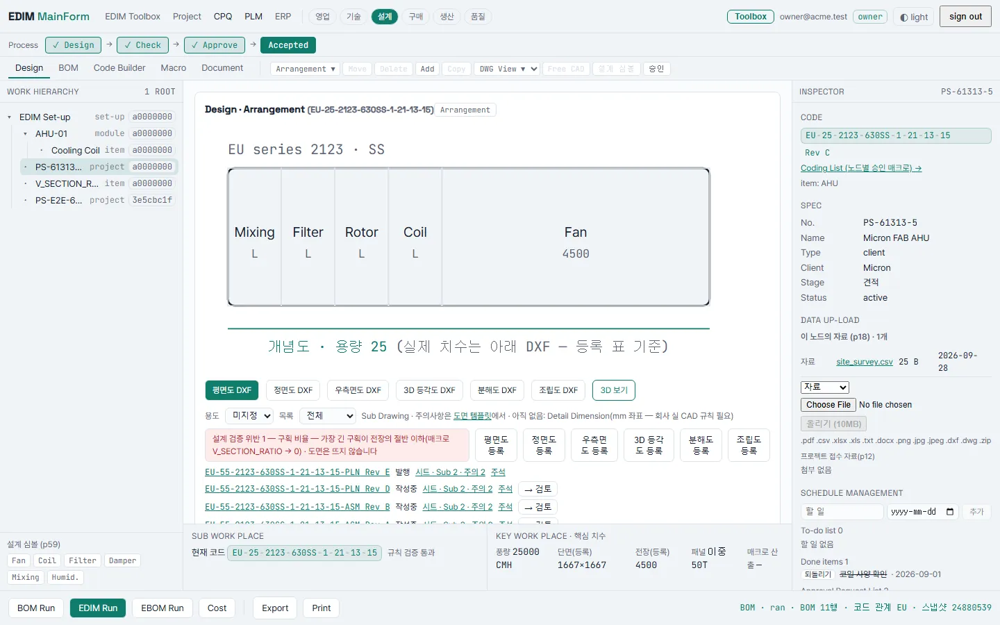
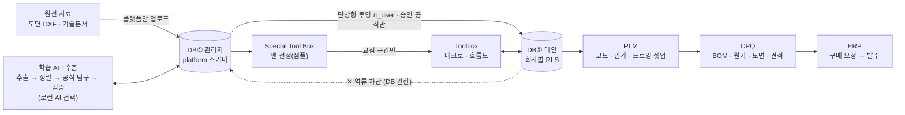
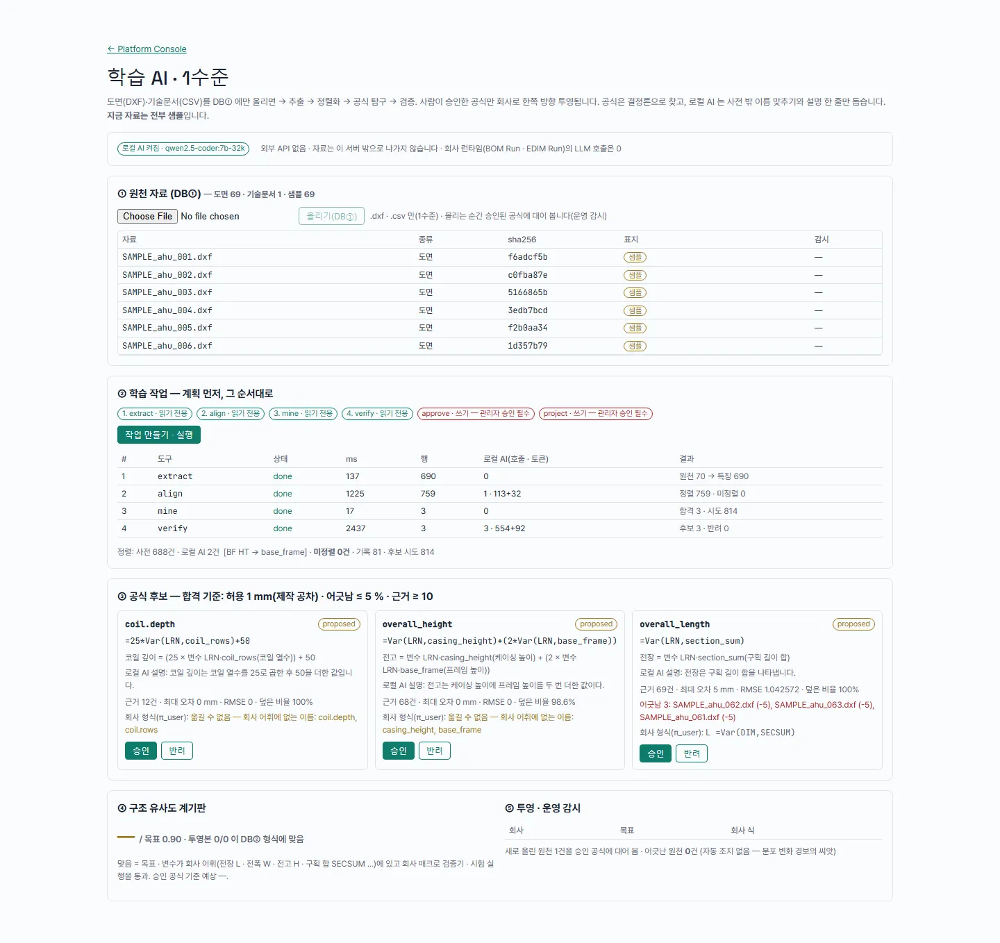
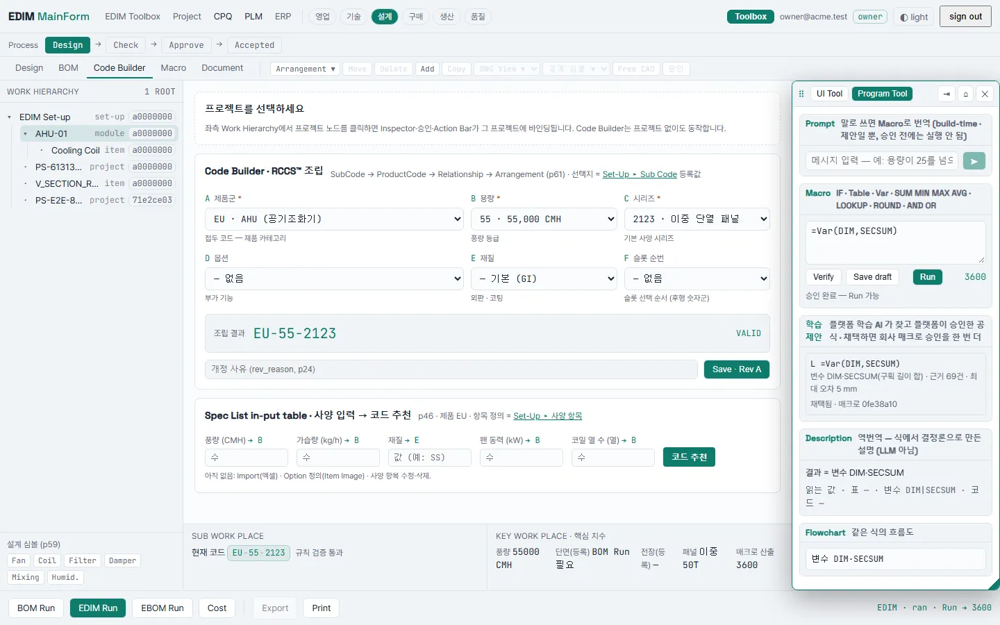
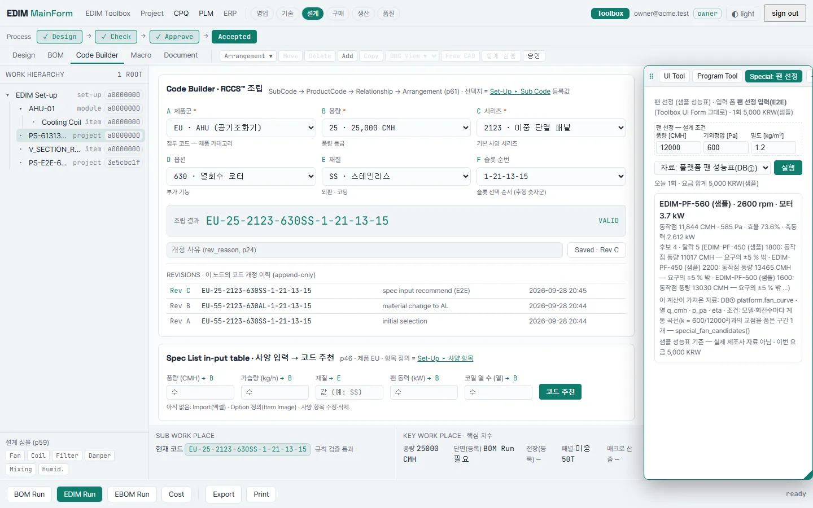

# EDIM — Configure-to-Order 플랫폼

**제품 코드 한 줄에서 BOM · 도면 · 원가 · 견적 · 구매가 나오는 주문생산(CTO) 플랫폼**

[](https://github.com/parksubeom99/EDIM/actions/workflows/ci.yml)


> 상태(2026-09-29 · main): 발표 시나리오 e2e **348/348** — 개발 모드 · 운영 모드(`next build → start`) · 단위 테스트 **295**(vitest) + auth · DB 검증 **11종** PASS · 청사진 70쪽 중 **실동 34 · 부분 12 · 미착수 5**(개념·표지 19 — 엘 확정판 3 · CC 초안 **37 · 10 · 4**, 엘 재측정 전)

## 왜 만들었나

공기조화기(AHU)처럼 **주문마다 사양이 조금씩 다른 제품**을 만드는 공장에서는, 고객이 풍량이나 재질을 하나 바꿀 때마다 설계자가 도면 · BOM · 원가 · 견적을 손으로 다시 만든다.
같은 숫자가 네 군데에 따로 적히니 어긋나고, 어느 견적이 어느 도면에서 나왔는지 거꾸로 따라갈 수 없다.
EDIM 은 회사가 **제품의 규칙을 한 번 등록**하면, 사양을 고르는 순간 그 규칙을 따라 모든 산출물이 **한 장의 스냅샷에서** 나오게 한다.

## 화면

| 작업대 — 청사진 p56 의 다섯 구역 | 코드 조립 A▼B▼C▼D▼E▼F▼ · 개정 Rev A→B | BOM Run → EBOM → Cost |
|---|---|---|
|  |  |  |

| 매크로 — 검증 → 초안 → 승인 | Toolbox — 식을 말로, 흐름도로 (LLM 없이) | Set-Up — 코드 관계가 곧 BOM |
|---|---|---|
|  |  |  |

| 도면 — 등록 치수 표에서 나온다 | 견적 · Tech Data · 구매 요청 | 구매 요청 → 견적 요청 → 발주 |
|---|---|---|
|  |  |  |

| 견적서 인쇄본 — 합계는 BOM 에 저장된 원가 그대로 (Word · Excel 로도) | 설계 검증 — 승인된 매크로가 규칙이 된다 | 플랫폼 콘솔 — 고객사 업무 데이터는 없다 |
|---|---|---|
|  |  |  |

전체 57장: [`docs/screens/`](docs/screens). 목업이 아니라 `scripts/demo_e2e.py` 가 매번 새로 찍는 실제 화면이다.

## 구조



- **3계층 권한**: 플랫폼 관리자 → 회사 관리자 → 사용자. 회사는 자기 코드 · 표 · 매크로를 직접 고치고(셀프서비스), 플랫폼으로 올라오는 것은 Special 의뢰 한 통로뿐이다. 플랫폼 계정은 고객사 업무 테이블에 **DB 권한이 없다**.
- DB①→DB② 쓰기는 SECURITY DEFINER 함수 하나(승인된 공식만)이고, Special 은 곡선 원자료가 아니라 계산에 필요한 구간만 회사로 준다. 둘 다 1수준 · 샘플 자료다.

## 설계 원칙

1. **결정론 런타임** — LLM 은 빌드 타임 번역기일 뿐이고 런타임 호출은 0이다. 매크로는 검증 → 초안 → 승인을 거친 식만 돌고, 같은 입력이면 같은 답이 나온다.
2. **스냅샷 불변** — BOM Run 은 스냅샷(`runId`)을 남기고, 원가 · 도면 · 견적 · Tech Data · 구매 요청은 다시 계산하지 않고 그 스냅샷을 읽는다. 승인 · 발행 · 발주는 스냅샷 한 장에 묶인다.
3. **멀티테넌트 격리를 DB 가 강제** — 회사 격리는 Postgres RLS, 개정 이력 append-only · 발행/발주 잠금은 트리거, DB②→DB① 역류 차단은 DB 권한이다. 애플리케이션 `if` 가 아니다.
4. **검증은 코드로** — 발표 시나리오 e2e(화면 + API + DXF 파싱) · DB 검증 9종 · 운영 모드(`next build → start`) e2e 를 머지마다 돌린다.

## 학습 AI 1수준 · Special 첫 사례 (샘플 자료)

- **학습 AI** — 플랫폼 관리자가 도면(DXF) · 기술문서(표)를 **DB① 에만** 올리면, 계획된 단계(추출 → 정렬화 → 공식 탐구 → 검증)가 돌아 공식 후보를 적합도와 함께 낸다.
  합격 기준은 정확도가 아니라 업무 영향이다 — 제작 공차 1 mm · 어긋난 도면 ≤ 5 % · 근거 도면 ≥ 10. 사람이 승인한 공식만 회사로 **한쪽 방향** 투영되고, 회사는 Toolbox 에서 채택 → 검증 → 승인을 한 번 더 거쳐 매크로로 쓴다.
  샘플 도면 68장에 숨겨 둔 공식 3개(전장 = Σ 구획 길이 · 전고 = 케이싱 + 2 × 프레임 · 코일 깊이 = 25 × 열수 + 50)를 다시 찾고, 잡음 도면 3장을 어긋남으로 드러낸다.
- **로컬 AI(선택)** — 이 서버 옆의 로컬 LLM(Ollama)이 사전에 없는 도면 이름을 **허용 목록 안에서만** 맞추고 공식에 설명 한 줄을 단다. 외부 API 키 없음 · 자료가 밖으로 나가지 않는다 · 공식은 만들지 않는다(결정론 탐구가 만든다) · 없으면 사전만으로 돈다. 회사 런타임의 LLM 호출은 여전히 0.
- **Special '팬 선정'** — 회사가 UI Form 으로 만든 입력 폼을 붙여 의뢰 → 플랫폼이 승인 + 부여 → 그 회사 Toolbox 에만 버튼 → 풍량 · 정압으로 동작점 · 효율 · 축동력 · 모터를 결정론으로 고르고 사용 기록(과금 근거 · 불변)을 남긴다. 성능표 · 단가는 샘플.

| 학습 작업 — 계획 · 단계 · 비용 | 공식 후보 — 적합도 · 어긋난 도면 · 로컬 AI 설명 | 회사 Toolbox — 학습 제안 채택 → Run | Special — 팬 선정 결과 |
|---|---|---|---|
|  |  |  |  |

## 빠른 실행

Docker 만 있으면 된다.

```bash
AUTH_SECRET=$(openssl rand -base64 32) docker compose -f docker-compose.prod.yml up -d --build
```

http://localhost:3000/login — 아래 **샘플 계정**(공개 데모용 · 실제 계정 아님), 비밀번호는 모두 `edim-demo-2026`.

| 이메일 | 역할 |
|---|---|
| `owner@acme.test` | 데모 회사 A 관리자(모든 화면) |
| `viewer@acme.test` | 데모 회사 A 열람자(고치기 · 내보내기 403) |
| `owner@globex.test` | 데모 회사 B — A 의 데이터가 보이지 않는다 |
| `platform@edim.test` | 플랫폼 관리자 — 고객사 업무 데이터에 권한 없음 |

개발 모드 · 환경변수 · 클라우드로 옮길 때: [`docs/DEPLOY.md`](docs/DEPLOY.md). 발표 절차: [`docs/DEMO.md`](docs/DEMO.md).

<details><summary>개발 모드로 띄우기 (pnpm)</summary>

```bash
docker compose up -d                      # PostgreSQL 16 (포트 5433)
cp .env.example .env
pnpm install --frozen-lockfile
pnpm db:generate && pnpm db:migrate
pnpm db:seed && pnpm db:seed:demo
pnpm dev                                  # http://localhost:3000
```
</details>

## 검증

| 항목 | 실측 (2026-09-28 · Windows 11 로컬 · main) |
|---|---|
| typecheck | 11 패키지 통과 |
| 단위 테스트 | 295 (vitest) + auth 2종(비밀번호 · 회사 격리) |
| DB 검증 | 11종 PASS — RLS · hierarchy · project · revision · backbone · platform · drawing · document · macro · **learning · special** |
| 발표 시나리오 e2e | **348/348** 개발 모드 · **348/348** 운영 모드 (배포 킷 컨테이너는 2026-09-28 에 334/334) |
| 운영 모드 동시 DB 연결 | 최대 17 (`pg_stat_activity`, e2e 중 표본) |
| CI | GitHub Actions — typecheck · 단위 · DB 검증 11종 (위 배지) |

```bash
pnpm typecheck && pnpm -r --workspace-concurrency=1 test
pnpm --filter @edim/db rls:test        # + hierarchy · project · revision · backbone · platform · drawing · document · macro · learning · special
pnpm db:reset:demo && pnpm dev          # 다른 창에서:
python scripts/demo_e2e.py http://localhost:3000 <캡처 폴더>
```

| 검증 | 무엇을 못 박는가 |
|---|---|
| `rls:test` · `platform:test` | 회사 격리 · 플랫폼 계정은 고객사 업무 테이블을 못 읽는다 |
| `revision:test` | 코드 개정은 append-only — 앱 역할에 UPDATE/DELETE 권한이 없다 |
| `drawing:test` · `document:test` | 산출물은 스냅샷을 참조하고, 발행·발주되면 **앱을 우회해도** 수정·삭제가 거부된다 |
| `learning:test` | 회사 계정은 DB① 학습 표를 읽지도 쓰지도 못하고, 플랫폼은 회사 업무 표를 못 읽는다 · 투영은 승인 공식만 함수로 · 회사는 제안의 식을 못 고친다 |
| `special:test` | 회사는 팬 성능표 원자료를 못 읽고 함수로 교점 구간만 받는다 · 부여는 승인된 의뢰만 · 사용 기록은 고치거나 지울 수 없다 · 플랫폼은 금액 칸만 |
| `demo_e2e.py` | 치수 표 한 칸 → 도면 폭만 변함(ezdxf 파싱) · 견적 합계 = 원가 = Word · Excel 의 값 · 구매 줄 = 스냅샷의 구매 품목 · 새 API 마다 열람자 403 · 다른 회사 404 |

## 샘플 데이터 고지

단가 · 기술 표 · 치수 표 · CAD 규칙 · 원가 배율 · 설계 검증 규칙 · **학습용 도면 68장과 기술문서** · **팬 성능표와 Special 단가**는 **모두 샘플**이며 실제 회사 자료가 아니다(파일 이름 · 화면에 '샘플' 표지).
견적은 구조 시연이고, 회사 실 단가표가 들어와야 실 견적이 된다. 샘플 계정 비밀번호(`edim-demo-2026`)는 공개 데모용 값이다.

## 정직 고지

- 실측은 **Windows 11 로컬**(Node 24 · pnpm 9.15.4 · Docker PG16 · Python 3.12)과 GitHub Actions CI 뿐이다. 클라우드 배포는 0회다(배포 킷까지).
- 도면은 **선과 글자** 수준이다(뷰 여섯 종 · 주석). 제작도 깊이가 아니고, EDIM 안의 CAD 편집기는 없다. 3D 는 구획 박스 뷰어다.
- 자연어 → 매크로 번역은 경로만 있고 실모델 호출은 0회다. 로컬 AI(Ollama)는 플랫폼 학습 작업의 이름 맞추기 · 설명 한 줄에만 쓰이고, 켜야 돈다(`EDIM_LOCAL_AI_URL` · 기본 꺼짐 — CI 는 꺼진 채로 돈다).
- 학습 AI 는 1수준이다 — 도면의 글자 · 선에서 뽑는다. 스캔 도면 OCR · 3D 형상 · PDF 문서 해석은 없다.
- 로그인은 이메일 + 비밀번호(scrypt)까지다. SSO 는 고객사 IdP 가 필요해 자리만 있다.
- 청사진 70쪽 중 없는 것은 [`page-map.md`](docs/00-corpus/page-map.md) 에 쪽마다 적혀 있다.

## 저장소 지도

| 경로 | 한 줄 |
|---|---|
| `apps/web` | Next.js App Router — 화면 + API(run · dxf · documents · purchase-requests · setup …) |
| `apps/web/app/lib/learning` · `lib/special` | 학습 AI(도구 등록부 · 추출 · 정렬 · 공식 탐구 · 유사도 · 로컬 AI) · Special 팬 선정 계산 |
| `packages/bom-code` | 등록된 코드 관계를 따라 BOM 을 내는 순수 엔진 + 설계 검증 규칙 + 데모 카탈로그 |
| `packages/macro-dsl` · `macro-verify` · `macro-compile` · `macro-registry` | 매크로 DSL 파서·실행기 · 정적 검증/dry-run · 역번역·흐름도 · 초안→승인→개정 |
| `packages/db` | Prisma 스키마 · 마이그레이션 0001~0034 · RLS · 트리거 · DB 검증 스크립트 · 샘플 학습 도면 · 샘플 팬 성능표 |
| `packages/auth` | 세션 · 비밀번호 · 회사 결정 · RBAC |
| `packages/core-ontology` · `hierarchy-address` · `ui` | 도메인 타입 · Work Hierarchy 주소 · 디자인 시스템 |
| `scripts/demo_e2e.py` | 발표 시나리오 e2e (화면 + API + DXF · Office 파일 파싱) |
| `docs/00-corpus` | 청사진 쪽 지도 · 설계 코퍼스 |
| `docs/01-design` · `04-decisions` | 설계 문서 · 결정 로그 |
| `docs/02-reports` · `plan` · `deck` | 대조표 생성기 · 연결 장부 · 발표 자료 |
| `docs/03-handoff` | 세션 인계 기록 |
| `docs/DEPLOY.md` · `DEMO.md` | 배포 킷 · 발표 절차 |

## English summary

EDIM is a Configure-to-Order (CTO) platform for build-to-order equipment such as air handling units.
A company registers its product rules once — codes, code relationships, tables and approved macros — and one assembled product code then yields the BOM, drawings (DXF), cost, quotation, tech data and purchase requests.
Every output reads the same immutable BOM snapshot, so the quotation total cannot drift from the cost card, and every printout names the snapshot it came from.
The runtime is deterministic: macros are verified, drafted and approved before they run, and no LLM is called at runtime.
Tenant isolation, append-only revisions and locks on issued documents are enforced by PostgreSQL (RLS, triggers, grants), not by application code.
Stack: TypeScript · Next.js 15 · PostgreSQL 16 · Prisma · pnpm monorepo; verified by an end-to-end scenario (UI + API + DXF/Office parsing) in both dev and production mode.
A level-1 learning pipeline lets the platform admin upload drawings to an isolated admin database, mine candidate formulas deterministically (a local LLM, when enabled, only helps name unfamiliar labels), and project human-approved formulas one way into a tenant's toolbox; a first "Special" program selects fans from sample performance curves.
All prices, tables, drawings, curves and rules in this repository are samples.

---

© 2026 EDIM. All rights reserved. 이 저장소는 포트폴리오 열람용으로 공개되며, 코드·문서의 복제·배포·상업적 이용을 허락하지 않습니다.
