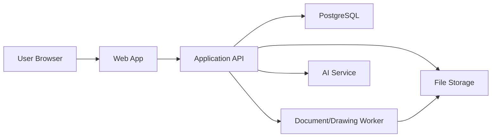

# Architecture

## 기본 방향

이 프로젝트는 SaaS 멀티테넌트 웹 애플리케이션으로 설계합니다.

초기 권장 기술 스택은 다음과 같습니다. 실제 구현 전에 변경할 수 있습니다.

- Frontend: Next.js, React, TypeScript
- Backend: Next.js API 또는 별도 Node.js/NestJS API
- Database: PostgreSQL
- ORM: Prisma
- Auth: 세션 기반 인증 또는 Auth.js
- File Storage: 초기 로컬 저장소, 이후 S3 호환 스토리지
- Document Generation: 서버 사이드 PDF/Excel/Word 생성
- AI: OpenAI API 또는 호환 AI 서비스

초기에는 한 저장소 안에서 프론트와 백엔드를 함께 관리하는 구조가 좋습니다. 제품이 커지면 API 서버, 작업 큐, 문서 생성 서버를 분리할 수 있습니다.

## 논리 구조

## 핵심 설계 원칙

### 멀티테넌트

모든 업무 데이터는 `tenant_id`를 가집니다.

한 회사의 사용자는 다른 회사의 고객, 프로젝트, BOM, 견적, 도면, 문서에 접근할 수 없어야 합니다.

### 권한

초기에는 역할 기반 권한으로 시작합니다.

- Owner
- Admin
- Sales
- Engineer
- Approver
- Viewer

나중에는 회사별로 세부 권한을 커스터마이징할 수 있게 확장합니다.

### 이력 관리

다음 데이터는 이력을 가져야 합니다.

- BOM
- 견적
- 품목
- 도면
- 승인 문서
- 커스터마이징 설정
- AI 매크로

### 커스터마이징

커스터마이징은 메타데이터 기반으로 설계합니다.

예:

- `custom_field_definitions`: 회사별 필드 정의
- `custom_field_values`: 실제 입력값
- `workflow_definitions`: 승인흐름 정의
- `document_templates`: 문서 양식 정의

### AI 안전 원칙

AI가 만든 매크로는 처음부터 자동 실행하지 않습니다.

권장 흐름:

1. 사용자가 자연어로 요청한다.
2. AI가 매크로 초안을 만든다.
3. 시스템이 위험한 동작을 검사한다.
4. 관리자가 검토한다.
5. 저장 후 제한된 권한 안에서 실행한다.

## 향후 분리 가능한 컴포넌트

- API 서버
- 도면/문서 생성 워커
- AI 매크로 실행 샌드박스
- 파일 변환 서비스
- 알림 서비스
- 감사 로그/분석 서비스

