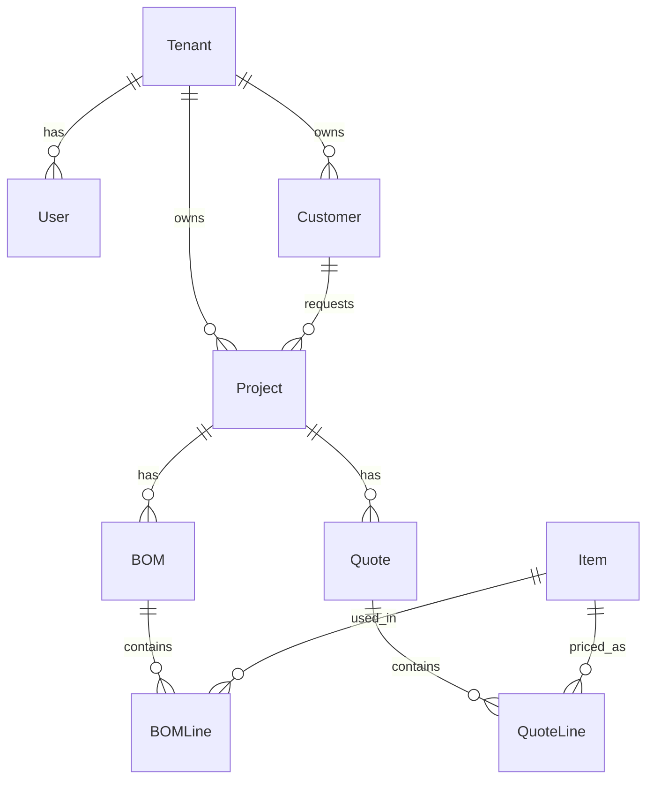

# Data Model

이 문서는 초기 데이터 모델 초안입니다. 실제 구현 과정에서 업무 규칙에 맞춰 계속 수정합니다.

## 핵심 엔티티

### Tenant

회사를 의미합니다.

주요 필드:

- `id`
- `name`
- `business_type`
- `status`
- `created_at`
- `updated_at`

### User

시스템 사용자입니다.

주요 필드:

- `id`
- `tenant_id`
- `email`
- `name`
- `status`
- `created_at`
- `updated_at`

### Role / Permission

사용자 권한을 관리합니다.

초기에는 기본 역할을 사용하고, 이후 회사별 권한 설정으로 확장합니다.

### Customer

고객사 또는 발주처입니다.

주요 필드:

- `id`
- `tenant_id`
- `name`
- `contact_name`
- `email`
- `phone`
- `address`

### Project

견적, BOM, 도면, 문서가 묶이는 업무 단위입니다.

주요 필드:

- `id`
- `tenant_id`
- `customer_id`
- `name`
- `code`
- `status`
- `owner_user_id`
- `created_at`
- `updated_at`

### Item

품목 마스터입니다.

주요 필드:

- `id`
- `tenant_id`
- `item_code`
- `name`
- `item_type`
- `unit`
- `standard_cost`
- `status`

### ItemRevision

품목의 버전 또는 리비전입니다.

주요 필드:

- `id`
- `tenant_id`
- `item_id`
- `revision`
- `description`
- `effective_from`
- `status`

### BOM

BOM 헤더입니다.

주요 필드:

- `id`
- `tenant_id`
- `project_id`
- `item_id`
- `revision`
- `status`
- `created_by`

### BOMLine

BOM 상세 라인입니다.

주요 필드:

- `id`
- `tenant_id`
- `bom_id`
- `parent_line_id`
- `item_id`
- `quantity`
- `unit`
- `loss_rate`
- `sort_order`

### Quote

견적 헤더입니다.

주요 필드:

- `id`
- `tenant_id`
- `project_id`
- `quote_no`
- `status`
- `currency`
- `subtotal`
- `discount_amount`
- `tax_amount`
- `total_amount`
- `created_by`
- `approved_at`

### QuoteLine

견적 상세 라인입니다.

주요 필드:

- `id`
- `tenant_id`
- `quote_id`
- `item_id`
- `description`
- `quantity`
- `unit_price`
- `cost_amount`
- `margin_rate`
- `sales_amount`

### DocumentTemplate

회사별 문서 양식입니다.

예:

- 견적서
- 기술자료
- 승인도서
- 제작지시서

### GeneratedDocument

생성된 문서입니다.

주요 필드:

- `id`
- `tenant_id`
- `project_id`
- `template_id`
- `document_type`
- `file_id`
- `status`
- `created_by`

### DrawingJob

도면 자동 생성 작업입니다.

주요 필드:

- `id`
- `tenant_id`
- `project_id`
- `bom_id`
- `status`
- `input_data`
- `result_file_id`
- `error_message`

### ApprovalWorkflow

승인흐름 정의입니다.

### ApprovalRequest

견적, 문서, 도면, 변경 요청 등에 대한 승인 요청입니다.

### CustomFieldDefinition

회사별 커스텀 필드 정의입니다.

대상 예:

- Customer
- Project
- Item
- BOM
- Quote
- Document

### CustomFieldValue

커스텀 필드 실제 값입니다.

### Macro

AI 또는 사용자가 만든 업무 자동화 매크로입니다.

주요 필드:

- `id`
- `tenant_id`
- `name`
- `description`
- `trigger_type`
- `status`
- `definition`
- `created_by`
- `reviewed_by`

### AuditLog

중요한 변경 기록입니다.

주요 필드:

- `id`
- `tenant_id`
- `actor_user_id`
- `action`
- `entity_type`
- `entity_id`
- `before_data`
- `after_data`
- `created_at`

## MVP 테이블 후보

첫 구현에서는 다음 테이블부터 시작합니다.

- Tenant
- User
- Customer
- Project
- Item
- BOM
- BOMLine
- Quote
- QuoteLine
- AuditLog

## 관계 초안

