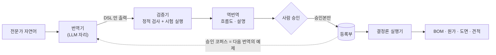

# 🤖 EDIM 의 AI 설계

> 한 줄: **AI 는 답을 만들지 않는다. AI 는 식(매크로)을 만들고, 식만 결정론으로 실행된다.**

제조 견적 · BOM · 도면에서 AI 가 틀리면 그것은 "품질 이슈"가 아니라 **돈과 제작이 틀리는 사고**다.
그래서 EDIM 의 AI 설계는 "어디에 AI 를 넣을까"보다 **"어디에서 AI 를 빼야 하나"**에서 시작했다.

| 문서 | 내용 |
|---|---|
| 이 문서 | 3대 원리 · 매크로 컴파일러 파이프라인 · 구현 현황 |
| [`learning-ai.md`](learning-ai.md) | 학습 AI 1수준 — 도면에서 공식을 찾는 에이전트 하네스 (1수준 완료 · 숨긴 공식 3/3 복원) |
| [`agentic-development.md`](agentic-development.md) | AI 코딩 에이전트와 함께 개발한 방식 — 인계 · 게이트 · 재측정 |

---

## 1. 3대 원리

| 원리 | 내용 | 효과 |
|---|---|---|
| **두 시계** | 빌드 타임(느림 · 사람 + AI · 매크로 생성/승인)과 런타임(빠름 · AI 0 · 결정론)을 구조적으로 분리 | 런타임 환각 가능성 0 |
| **결정론 최대 · AI 최소** | 확정 문법 → DSL(AI 0) · 데이터 위치 발췌 → 주소 해석기(AI 0) · **진짜 새 계산 한 구간만** 빌드 타임 AI | 비용 0 · 지연 0 · 재현 100 % |
| **이중 투영** | 통합 학습 1회 → 관리자용(DB①, 원본 · 전체) · 사용자용(DB②, 정제 · 승인분) 두 출력 | 두 DB 의 형식이 자연히 90 % 유사 · 역류는 DB 권한으로 차단 |

## 2. 매크로 컴파일러 — "LLM 은 컴파일러의 앞단이다"

컴파일러로 보면 전체가 풀린다.

| 컴파일러 용어 | EDIM | 담당 |
|---|---|---|
| 소스 코드 | 전문가의 자연어 의도("팬 샤프트 길이는 임펠러 + 케이싱 + 베어링") | 사람 |
| 프런트엔드(번역) | 자연어 → Macro DSL | **LLM 자리** (공급자 교체형 인터페이스 · 키 없으면 폴백) |
| 중간 표현(IR) | Macro DSL — **유일한 실행 대상** | `packages/macro-dsl` |
| 정적 분석 | 파스 · 주소 · 타입 · 순환 검사 + 시험 실행 | `packages/macro-verify` |
| 역컴파일 | DSL → 흐름도 · 한국어 설명 (LLM 없음) | `packages/macro-compile` |
| 링크 · 배포 | 초안 → 검토 → 승인 → 개정 | `packages/macro-registry` |
| 런타임 | 결정론 실행기 → BOM · 원가 · 도면 | `macro-dsl` executor · `bom-code` |



### 번역 루프 — 검증기가 LLM 을 가르친다 (`packages/macro-compile`)

```text
자연어 ─▶ LLM(후보 1줄) ─▶ 파스 + 정적 검증 ── 오류 0 ─▶ verified: true ─▶ 승인 단계로
                ▲                    │
                └── 진단(diagnostics)을 붙여 재요청 (최대 2회 재시도 = 최대 3회 호출)
재시도가 끝나도 오류면: 마지막 후보 + 진단을 verified: false 로 그대로 돌려준다(숨기지 않음)
→ 승인 단계는 verified === true 만 받는다 → 검증 안 된 식은 절대 실행되지 않는다
```

| 설계 포인트 | 구현 |
|---|---|
| **프롬프트 = 목표 언어 명세** | 시스템 프롬프트가 파서가 받는 문법(13개 함수 · 주소 · 산술)을 그대로 적는다(`prompt.ts`) |
| **프롬프트와 검증기가 어긋나지 않게** | few-shot 예제를 파서 · 실행기 테스트가 고정한 사례에서 가져온다 |
| **예약어 차단** | 의미가 미확정인 토큰(PreC · Table 3번째 인자 · Var(FES)) 은 프롬프트에서 금지 + 실행기에서 잠금 |
| **출력 형식 강제** | "`=` 로 시작하는 한 줄만" — 설명 · 코드 펜스 금지 |
| **LLM 은 주입된 인터페이스로만** | 컴파일러는 네트워크를 모른다(`LLMClient.complete`). 테스트는 **대본 클라이언트**를 주입해 "모델이 같은 실수를 반복하는" 경우까지 네트워크 없이 재현 |
| **실패를 숨기지 않는다** | 전송 실패는 `llmError`, 검증 실패는 진단 목록으로 구분해 반환 |

**왜 역번역을 LLM 없이 하나** — AI 가 만든 식을 AI 가 설명하면, 틀린 식을 그럴듯하게 설명할 수 있다. 식을 기계적으로 흐름도 · 문장으로 바꾸면 **설명이 곧 식**이므로 사람이 판정할 수 있다.

**v1 함수 집합**: 관측 함수 5개(IF · Table · Var · PreC · Run) + 엑셀 코어 8개(SUM · MIN · MAX · AVG · LOOKUP · ROUND · AND · OR). 해석이 확정되지 않은 토큰은 실행기에서 **예약어로 잠가** 실행되지 않게 했다.

## 3. 도구 계층 = 요금 계층

| 계층 | 누가 만드나 | 무엇으로 | 과금 |
|---|---|---|---|
| Toolbox 매크로 | 회사 내부 담당자(셀프서비스) | Macro DSL · UI 폼 | 기본 |
| Special Tool Box | 플랫폼(우리) | 매크로로 안 되는 계산 · DB① 자료 | 별도 과금(SI) |
| 학습 AI | 플랫폼 | 회사 동의 원천 자료 → 승인 공식 | 플랫폼 자산 |

해자(moat)는 AI 자체가 아니라 **정해진 형식과 정렬된 DB** 다. 형식이 같아야 회사 매크로 · Special · 학습 결과가 서로 호환된다.

## 4. 구현 현황 (정직하게)

| 항목 | 상태 | 근거 |
|---|---|---|
| DSL 파서 · 실행기 · 검증기 · 역번역 · 등록부 | ✅ 동작 | 단위 101 · `macro:test` · e2e 매크로 단계 |
| 설계 검증에 매크로 사용 | ✅ 동작 | 승인된 매크로만 규칙으로 인정 · 위반 시 도면 발행 422 |
| 자연어 → DSL 번역 | 🟡 경로 · 인터페이스만 | 실모델 호출 0회 (공급자 키 결정 대기) |
| 학습 AI 1수준 | ✅ 2026-09-29 | [`learning-ai.md`](learning-ai.md) · 로컬 AI(Ollama) 선택 |
| Special Tool Box 첫 사례(팬 선정) | ✅ 2026-09-29 | 결정론 계산 · 원자료는 DB① 에만(교점 구간만 함수로) · 손 계산 대조 |
