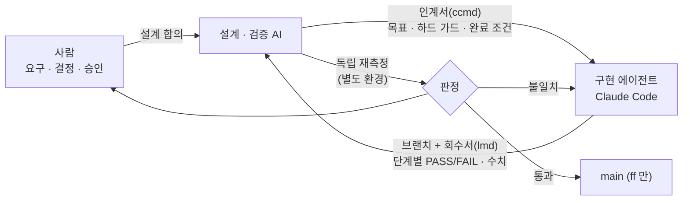

# 🛠️ AI 에이전트와 함께 개발한 방식

> 이 저장소의 코드 상당 부분은 AI 코딩 에이전트(Claude Code)가 작성했다. **요구사항 분석 · 설계 결정 · 승인 · 검증 게이트 설계와 판정은 사람이 맡았다.**
> 핵심은 "AI 가 빨리 쓰게 하는 것"이 아니라 **"AI 가 쓴 것을 믿을 수 있게 만드는 체계"** 였다.

## 1. 역할 분담

| 역할 | 하는 일 | 하지 않는 일 |
|---|---|---|
| 사람 | 요구 · 방향 · 설계 결정(ADR) · 체크포인트 승인 · 되돌릴 수 없는 작업 승인 | 매 줄 코드 작성 |
| 설계 · 검증 AI | 청사진 · 코퍼스 전수 대조 → 인계서 작성 · 결과 재측정 · 판정 보고 | 판정 없이 "완료" 단정 |
| 구현 에이전트 | 인계서대로 구현 · 자기 검증 · 브랜치 · 회수서 | main 직접 커밋 · force push · 이력 재작성 |

## 2. 인계서에 반드시 들어가는 것

- **완료 조건 표** — 무엇이 되면 끝인가, 무엇으로 증명하나
- **하드 가드** — main 직접 커밋 · force push 금지 · 마이그레이션은 추가만 · 새 API 는 열람자 403 · 타사 404 단언 · 스냅샷 불변 · 비밀값 커밋 전 검사
- **머지 게이트** — typecheck → 단위 → DB 초기화 후 DB 검증 → e2e 개발 모드 + 운영 모드(연결 수 기록) → ff 머지 → 머지된 main 에서 한 번 더
- **외부 입력이 필요한 것은 만들지 않는다** — 지어내지 말고 "아직 없음 — 필요한 입력: …"
- **막히면 그 항목만 FAIL** — 마지막 PASS 위에서 다음 항목

인계 · 회수 기록: [`docs/03-handoff/`](../03-handoff)

## 3. 에이전트 보고를 믿지 않고 다시 잰 덕분에 잡은 것

| 발견 | 어떻게 | 결과 |
|---|---|---|
| 운영 빌드에서만 연결 고갈(HTTP 500) | 개발 모드 통과 보고 후, 별도 환경에서 `next start` 로 재측정 | 수리 + 운영 모드 게이트 신설 ([T-01](../troubleshooting.md#t-01)) |
| 한 번도 안 돌던 DB 검증 2종과 그 속 제품 결함 | CI 목록과 실제 실행 목록 대조 | 결함 수리 · CI 배선 ([T-04](../troubleshooting.md#t-04)) |
| 승인 안 된 치수로 도면이 발행될 수 있는 구멍 | 스냅샷 · 카탈로그 경계 대조 | 409 차단 → 치수를 스냅샷에 박음 ([T-03](../troubleshooting.md#t-03)) |
| "통과"로 보고된 e2e 단계가 실제로는 아무것도 기다리지 않음 | 단언 조건 재독 ("approved" 글자가 다른 목록에도 있었음) | 승인 응답을 기다리게 수리 |

## 4. 결과

- 청사진 70쪽을 쪽 단위로 대조하는 표를 유지하며, 구현 대상 51쪽 중 실동 비율을 매 단계 재측정했다.
- main 은 fast-forward 머지만으로 쌓였다(이력 재작성 0).
- 한 번의 야간 작업 단위(인계서 1건)로 청사진 여러 쪽을 닫고, 아침에 재측정으로 판정하는 리듬을 만들었다.
