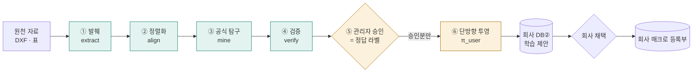

# 🧠 학습 AI 1수준 — 도면에서 공식을 찾는 에이전트 하네스

> 상태: **1수준 구현 완료 · main 반영(2026-09-29, `f1221b7`)**. 샘플 도면 68장 + 기술문서 표 1개에 숨겨 둔 공식 **3개를 모두 다시 찾았고**(최대 오차 0 mm),
> 현장 수정본을 흉내 낸 잡음 도면 **3장을 모두 '어긋남'으로** 드러냈다. 사전 밖 약어(`BF HT`)는 로컬 AI 가 허용 목록 안에서 맞춰 **미정렬 0**,
> 회사로 투영한 공식의 구조 유사도 **1.00**(목표 0.90). 역류 차단은 `learning:test` 24/24, 흐름은 e2e S72a~h(개발 · 운영 모드)가 매 머지마다 확인한다.

## 1. 문제 정의

| 질문 | 답 |
|---|---|
| 무엇을 예측/발견하나 | 한 회사 도면들 속 **치수 사이의 관계식**(예: 전장 = Σ 구획 길이) |
| 결과를 누가 쓰나 | 플랫폼 관리자가 승인 → 회사 Toolbox 에 '학습 제안'으로 → 회사가 채택하면 그 회사 매크로가 된다 |
| 왜 가치가 있나 | 도면 수백 장이 **마스터 규칙 한 줄**이 된다. 치수 하나를 바꾸면 관련 치수가 전부 따라간다 |
| 왜 1수준을 설명 가능한 방법으로 | 제조 현장은 블랙박스 규칙을 믿지 않는다. 찾은 공식이 그대로 DSL 이면 사람이 읽고, 검증기가 검사하고, 실행기가 돌린다 |

## 2. 파이프라인

초록 = 읽기 전용 도구(자동 실행) · 주황 = 쓰기 도구(사람 승인 관문 필수). 승인은 두 번이다 — 플랫폼 관리자 1번, 회사 1번.

## 3. 에이전트 하네스 설계

프로덕션 AI 에이전트 하네스의 검증된 구조 원리를 **결정론 파이프라인**에 옮겼다(코드가 아니라 구조).

| 원리 | EDIM 에서의 모양 |
|---|---|
| 도구 = 수명주기 3단 | 모든 도구가 `validate(input) → authorize(ctx) → run(input, ctx)` |
| 읽기 전용 표시 | `readOnly` 도구는 자동, 아니면 승인 관문 통과 후에만 |
| 도구 등록부 한 곳 | 실행기는 이름 → 도구 맵을 돌 뿐 · 도구 추가 = 항목 하나 |
| 계획 먼저 | 작업 생성 시 단계 목록을 `learning_job.plan` 에 먼저 저장 |
| 작업 그래프 영속화 | 단계 상태를 `learning_step` 에 저장 → 끊겨도 이어서 |
| 하위 에이전트 = 격리 작업자 | 발췌 · 정렬화는 자기 입력만 보고 결과를 표에 쓴다 |
| 지식은 필요할 때만 | 정렬화 사전은 align 이 부를 때만 로드 |
| 비용 기록 | 단계마다 ms · 행 수 · 로컬 AI 호출 수 · 토큰(입력/출력) · 모델 → 운영 · 과금 근거 |

## 4. 공식 탐구 방법 (결정론)

1. 목표 특징 y 와 같은 도면의 정렬된 특징으로 후보 형태를 만든다: `a·x + b` · `a₁·x₁ + a₂·x₂ + b` — **목표 포함 특징 3개 이하**(조합 폭발 상한 · 초과 시 '상한 도달' 보고). 구획 길이의 합(`section_sum`)은 정렬화가 파생 특징으로 미리 만든다.
2. 최소제곱 적합 → 허용 밖 기록을 빼고 **한 번 더** 적합(잡음이 계수를 끌지 않게) → 계수를 깔끔한 값(0.5 단위 · 정수 절편)으로 반올림해 여전히 맞으면 그 값 → 도면별 오차 |ŷ − y|.
   설명력 가드: 목표 값의 폭이 허용의 20배 미만이면 목표에서 빼고, R² ≥ 0.99 를 요구한다(핀 피치처럼 거의 안 변하는 값을 '공식'으로 받지 않게).
3. **합격 기준 = 업무 영향 기준**: 오차 허용 1 mm(제작 공차) · 허용 밖 도면 ≤ 5 % · 근거 도면 ≥ 10장.
4. 같은 목표의 합격 후보가 여럿이면 특징 수가 적은 식(단순한 설명) 우선. 같은 특징 묶음을 다른 목표로 다시 내지 않는다(`H = C + 2F` 와 `C = H − 2F` 는 같은 사실 — 전장 · 전고 같은 결과 치수를 먼저 설명).
5. 결과는 Macro DSL 로 적어 검증기 · 시험 실행을 통과해야 `proposed`.

## 5. 평가 · 운영

| 실무 원칙 | 적용 |
|---|---|
| 라벨 품질 | 관리자 승인이 정답 라벨. 정렬되지 않은 이름은 숨기지 않고 "미정렬 n건"으로 드러낸다 |
| 평가지표 | 정확도가 아니라 제작 공차 · 어긋난 도면 비율 · 근거 수 |
| 배포 전략 | 학습 = 배치(작업 단위) · 사용 = 결정론 실행(런타임 AI 0) |
| 운영 모니터링 | 새 도면이 승인 공식에서 어긋나면 계기판에 수 표시(분포 변화의 씨앗) |
| 구조 유사도 | 투영본 중 회사 DB② 형식에 맞는 비율 — 목표 · 변수가 회사 어휘(`Var(DIM, L · W · H · SECSUM …)`)에 있고 회사 검증기 · 시험 실행을 통과. 목표 ≥ 0.90 · 실측 1.00 |

## 6. 경계 (DB 권한으로)

- 회사 계정은 DB① 을 읽지도 쓰지도 못한다.
- 플랫폼 계정은 회사 업무 표를 읽지 못한다.
- DB① → DB② 는 `SECURITY DEFINER` 함수 하나로만, 승인된 공식만, 식 · 목표 · 적합도 요약만 간다. 원천 파일 · 특징 원값 · 출처는 **투영에서 빠지는 10 %** 다.

## 7. 합격 시험 (샘플 자료) — 결과

`scripts/make_learning_samples.ts`(시드 고정 · 우리 DXF 생성기) → 샘플 도면 68장(깨끗 60 · 잡음 3 · 이름 다른 5) + 기술문서 CSV 12행. 정답은 `ANSWERS.json` 에 미리 적어 둔다.
(깨끗한 도면을 40 → 60장으로 늘린 이유: 잡음 3장 / 48장 = 6.25 % 는 합격 기준 '어긋남 ≤ 5 %'와 스스로 모순 — 기준을 바꾸지 않고 표본을 늘렸다.)

| 정답(미리 적음) | 찾아낸 식 | 근거 · 최대 오차 |
|---|---|---|
| 전장 = Σ 구획 길이 | `=Var(LRN,section_sum)` | 68장 · 잡음 3장 −5 mm(어긋남으로 표시) · 나머지 0 |
| 전고 = 케이싱 + 2 × 프레임 | `=Var(LRN,casing_height)+(2*Var(LRN,base_frame))` | 68장(로컬 AI 가 `BF HT` 2장을 맞춤) · 0 mm |
| 코일 깊이 = 25 × 열수 + 50 | `=25*Var(LRN,coil_rows)+50` | 12행 · 0 mm |

- 이름이 다른 5장(`Overall L` · `LENGTH` · `전장` · `OAL` · 인치 표기)은 정렬화 사전이 모두 맞췄다.
- 구현하며 드러난 것: Macro DSL 의 사칙연산은 **우선순위 없이 왼쪽부터** 계산된다 → 곱하는 항을 괄호로 적는다(단위 테스트가 먼저 잡음 · [트러블슈팅 T-08](../troubleshooting.md#t-08)).

## 7-1. 로컬 AI (선택)

이 서버 옆의 로컬 LLM(Ollama · 기본 `qwen2.5-coder:7b-32k`)을 `EDIM_LOCAL_AI_URL` 로 켠다. 하는 일은 둘뿐이다:
사전 밖 이름을 **허용 목록 안에서만** 고르기(JSON 스키마로 출력 제한 · 목록 밖 · 모름 = null) · 공식 카드의 한국어 설명 한 줄.
**공식은 만들지 않는다**(결정론 탐구가 만들고 검증기 · 사람 승인을 거친다). 외부 API 키 0 · 자료가 서버 밖으로 나가지 않는다 · 꺼져 있으면 사전만으로 돈다(CI 는 꺼진 채).
실측: 학습 작업 전체 8.6초(모델 적재 뒤) — 정렬 1회 호출 113 + 32 토큰, 설명 3회.

## 8. 1수준 밖 (2수준 과제)

비선형 · 조건부 규칙 · 여러 도면에 걸친 관계 · PDF 문서 해석 · 스캔 도면 OCR · 도면 형상(3D) 학습 · 실제 회사 도면(지금은 전부 샘플).
