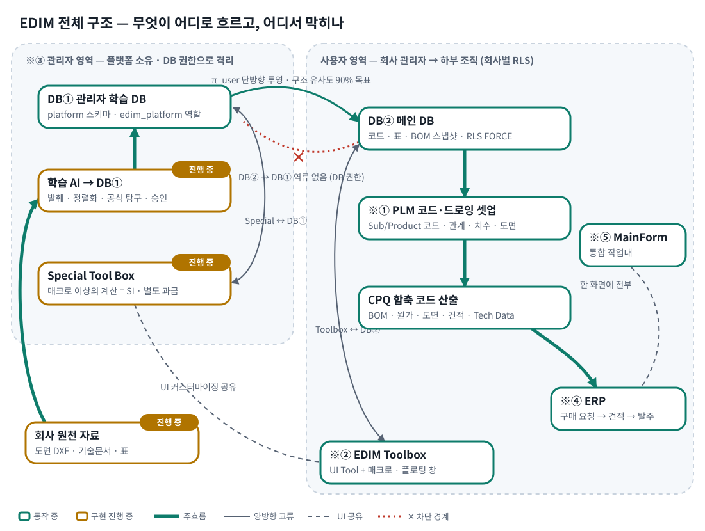
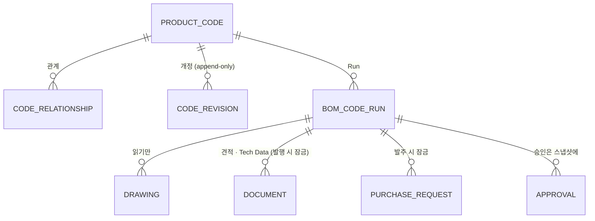
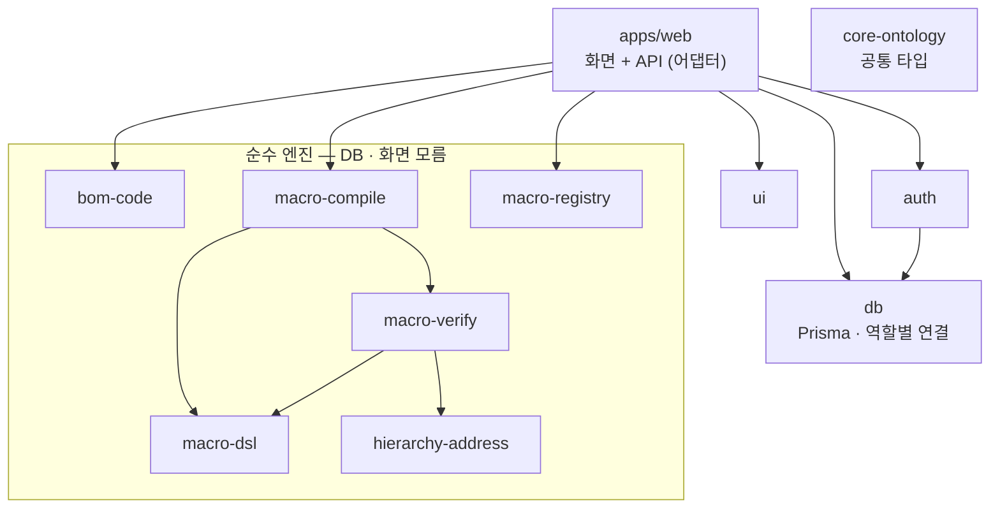

# 🏗️ EDIM 아키텍처 — 숲에서 나무로

이 문서는 **1층(전체) → 2층(영역) → 3층(데이터 · 경계)** 순서로 내려간다.

---

## 1층 — 두 영역, 한 방향

| 영역 | 소유 | 담는 것 | DB 역할 |
|---|---|---|---|
| ※③ 관리자 영역 (DB①) | 플랫폼 | 학습 원천 자료 · 학습 결과 · Special 프로그램 · 팬 성능 원자료 | `edim_platform` — 회사 업무 테이블 GRANT 0 |
| 사용자 영역 (DB②) | 회사 | 코드 · 관계 · 표 · 매크로 · 스냅샷 · 문서 · 구매 | `edim_app` — RLS FORCE, 자기 회사 행만 |

흐름 규칙:
1. **회사 → 플랫폼**: 요청서(`platform_request`) 한 통로뿐. 업무 데이터는 올라가지 않는다.
2. **플랫폼 → 회사**: 승인된 결과만, `SECURITY DEFINER` 함수 하나로(학습 투영 · Special 부여).
3. **DB② → DB①**: 없다. "하면 안 된다"가 아니라 **권한상 불가능**하다.

## 2층 — 사용자 영역의 다섯 구역

| 구역 | 역할 | 대표 화면 · API |
|---|---|---|
| ※① PLM | Sub · Product 코드, 코드 관계, 표, 치수 표, 배치(Arrangement), 개정 | `/setup/*` · `/api/setup/*` |
| CPQ | 코드 조립 → BOM Run → 원가 · 도면 · 견적 · Tech Data | `/workbench` · `/api/run` · `/api/dxf` · `/api/documents` |
| ※② Toolbox | UI 폼 · 매크로(DSL) · 역번역 흐름도 — MainForm 옆 플로팅 창 | `/api/macros` · `/api/ui-forms` |
| ※④ ERP | 구매 요청 → 견적 요청 → 발주 · 단가 이력 · 기준정보 | `/api/purchase-requests` · `/setup/erp` |
| ※⑤ MainForm | 위 전부를 한 화면에서 — 계층 주소(좌) · 작업(중) · 기술 · 코드(우) | `/workbench` |

## 3층 — 스냅샷이 모든 것을 묶는다

`bom_code_run` 한 행에는 BOM 행 · 치수 · 카탈로그 지문 · 사용된 매크로 id · 개정 · 단가 출처가 함께 박힌다. 그래서 어떤 견적서든 "어느 규칙 · 어느 개정 · 어느 기준일 단가에서 나왔나"를 역으로 따라갈 수 있다.

## DB 가 강제하는 규칙 (애플리케이션이 아니라)

| 규칙 | 수단 | 마이그레이션 | 검증 |
|---|---|---|---|
| 회사 격리 | RLS ENABLE + FORCE · `app.current_tenant` | 0002 이후 모든 업무 표 | `rls:test` |
| 코드 개정 불변 | 앱 역할 UPDATE/DELETE REVOKE | 0005 | `revision:test` |
| 발행 문서 · 발주 구매 잠금 | 트리거 | 0008 · 0009 · 0010 | `drawing:test` · `document:test` |
| 관리자/사용자 분리 | 스키마 · 역할 GRANT | 0007 | `platform:test` |

## 패키지 경계

모든 패키지는 `core-ontology`(공통 타입)만 공유한다. `bom-code` 는 다른 내부 패키지에 의존하지 않는다.

설계 결정의 이유는 [`docs/adr/`](../adr) 에 있다.
